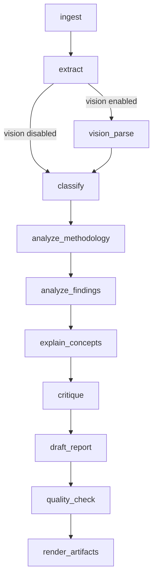

# Brainstorming Process

Paper Digest uses a **brainstorm-then-synthesize** pattern. Several LLM passes extract structured analysis from a paper; a final pass turns that material into reader-facing prose. The intermediate outputs are brainstorming inputs — especially critiques — not the final article.

This document describes the pipeline logic, how context is passed between steps, and the full prompt text for each brainstorming stage.

## Overview



| Phase | Steps | Role |
|-------|-------|------|
| Preparation | ingest → extract → (optional) vision_parse | Resolve the PDF, extract text/metadata, optionally parse figures and tables |
| Brainstorming | classify → analyze_methodology → analyze_findings → explain_concepts → critique | Build structured, evidence-backed analysis as JSON |
| Synthesis | draft_report | Write the final blog from structured analysis |
| Validation | quality_check → render_artifacts | Flag weak evidence locally; write `digest.md`, `critiques.md`, traces |

The brainstorming phase is **sequential and cumulative**. Each step adds to shared state; later steps see earlier outputs. Only `critique` and `draft_report` receive the full structured analysis.

## Design principles

1. **Separate thinking from writing.** Brainstorming steps produce structured JSON with evidence references. The blog step produces narrative prose.
2. **Critiques are inputs, not sections.** Critique lenses (novelty, reproducibility, SOTA, etc.) are meant to be woven into caveats and interpretation — not copied as a checklist in the final article.
3. **Evidence over fluency.** Every analysis step asks for page references, numbers, and uncertainty when the source text is incomplete.
4. **Adaptive structure.** Classification steers how the final blog is organized (empirical vs method vs reference), but the blog prompt chooses sections dynamically rather than using a fixed template.
5. **Auditable artifacts.** Each LLM call is traced with prompt version, inputs, and JSON output under `output/<paper_slug>/`.

## Context passing

Two helper functions in `graph.py` build the user prompt for each step.

### `_paper_context`

Raw paper content passed to early steps:

- PDF metadata (title, authors, page count, etc.)
- Full extracted text, page by page
- Optional vision extractions (figures, tables, equations, visual summaries)

Long papers are truncated intelligently: text is sampled across all pages (not just the beginning), and both the front and appendix/tail of the document are preserved when possible.

### `_analysis_context`

Used by **methodology**, **findings**, and **explanations**:

```
Classification:
{PaperClassification JSON}

Paper content:
{_paper_context}
```

Classification is available so later steps can tailor emphasis (e.g. experimental controls for empirical papers, system flow for method papers).

### `_structured_context`

Used by **critique** and **draft_report** (blog):

```
Structured analysis:
{classification, methodology, findings, explanations, critiques}

Paper context:
{_paper_context, max 50k chars}
```

Critique sees everything except itself. The blog step sees the full structured analysis including critiques.

## Brainstorming steps

Each step uses a system prompt from `src/paper_digest/prompts/`, a user prompt built from context above, and a Pydantic response schema enforced via structured JSON output.

---

### 1. Classify (`classify.md`)

**Purpose:** Route the paper into one of three kinds so downstream analysis and blog structure can adapt.

**Prompt version:** `classify-v1`

**Response model:** `PaperClassification`

| Field | Description |
|-------|-------------|
| `kind` | `empirical_findings`, `core_methodology`, or `blog_reference` |
| `confidence` | 0.0–1.0 |
| `rationale` | Why this kind was chosen |
| `evidence_pages` | Pages supporting the classification |
| `suggested_rubric` | Optional evaluation hints |

**System prompt:**

> You classify research inputs for a paper-digest workflow.
>
> Choose exactly one kind:
>
> - empirical_findings: mainly reports experiments, measurements, benchmarks, or observational findings.
> - core_methodology: introduces a new algorithm, method, architecture, formalism, or technical procedure.
> - blog_reference: is primarily a reference article, tutorial, note, or non-paper source.
>
> Use evidence from the provided text. If unsure, choose the best fit and lower confidence.

---

### 2. Analyze methodology (`methodology.md`)

**Purpose:** Explain the paper's core method, design, or experimental setup.

**Prompt version:** `methodology-v1`

**Response model:** `MethodologyAnalysis`

| Field | Description |
|-------|-------------|
| `overview` | High-level summary |
| `core_algorithm_or_method` | The central technique or design |
| `steps` | Ordered procedure steps |
| `assumptions` | Key assumptions |
| `important_formulas` | Formulas worth explaining later |
| `evidence` | Page-specific evidence refs |
| `uncertainties` | Gaps or ambiguities in the extracted text |

**System prompt:**

> You explain the core methodology of a research paper for a technical reader.
>
> Focus on:
>
> - the central algorithm, method, or empirical design;
> - important steps and assumptions;
> - equations or formulas that deserve explanation;
> - for method papers, the system flow, components, optimization target, and what changes versus what stays fixed;
> - name the exact training objective, loss, target representation, or evaluation criterion when the paper provides it;
> - for empirical papers, the experimental controls needed to support the main claims, including relevant ablations or controlled comparisons;
> - what evidence in the paper supports your reading;
> - uncertainty when the extracted text is incomplete.
>
> Be precise, evidence-backed, and concise.

---

### 3. Analyze findings (`findings.md`)

**Purpose:** Extract results, benchmarks, and claim-level evidence.

**Prompt version:** `findings-v1`

**Response model:** `FindingsAnalysis`

| Field | Description |
|-------|-------------|
| `important_findings` | Key takeaways |
| `datasets_or_inputs` | Data and setup |
| `metrics` | Evaluation metrics used |
| `baselines` | Comparison methods |
| `reported_results` | Specific numbers and outcomes |
| `limitations` | Author-stated or inferred limits |
| `evidence` | Page-specific evidence refs |

**System prompt:**

> You extract important findings and results from a research paper.
>
> Capture:
>
> - datasets, inputs, or experimental setup;
> - metrics and baselines;
> - reported quantitative or qualitative results;
> - claim-by-claim evidence, especially the exact benchmark numbers, ablation comparisons, or other measured outcomes that support each central claim;
> - mechanisms proposed by the authors, such as why a result happens, when those mechanisms are backed by experiments;
> - appendix or late-paper analyses that explain headline claims, including mechanism, scaling, robustness, safety, efficiency, or failure analyses;
> - limitations and reproducibility clues;
> - page-specific evidence.
>
> Prefer specific numbers over generic statements. If the paper compares conditions, variants, scales, datasets, model sizes, training settings, or system designs, extract the direction and the actual values when available.
>
> When the paper's main contribution is a set of claims, make the extracted findings usable for a claim-by-claim blog: identify the claim, the experiment or analysis supporting it, the measured effect size, and any caveat.
>
> Do not inflate claims beyond what the paper supports.

---

### 4. Explain concepts (`explanations.md`)

**Purpose:** Demystify vague, mathematical, or difficult concepts before synthesis.

**Prompt version:** `explanations-v1`

**Response model:** `ConceptExplanationSet` → list of `ConceptExplanation`

| Field | Description |
|-------|-------------|
| `concept` | Name of the concept |
| `explanation` | Plain-language explanation |
| `why_it_matters` | Relevance to the paper |
| `source_pages` | Where it appears |
| `confidence` | 0.0–1.0 |
| `follow_up_questions` | Open questions if the paper is unclear |

**System prompt:**

> You generate multiple explanations for vague, mathematical, or difficult concepts in a paper.
>
> Prefer concepts that are central to understanding the paper. For each explanation:
>
> - name the concept;
> - explain it in plain language;
> - explain why it matters to the paper;
> - cite source pages when available;
> - include follow-up questions when the paper remains unclear.

---

### 5. Critique (`critique.md`)

**Purpose:** Multi-lens skeptical review. This is the step most explicitly framed as **brainstorming input** for the final blog.

**Prompt version:** `critique-v1`

**Response model:** `CritiqueSet`

| Field | Description |
|-------|-------------|
| `critiques` | List of per-lens critiques |
| `synthesis` | Cross-lens summary |
| `final_sota_stance` | `likely_sota`, `strong_but_not_clearly_sota`, `incremental`, `insufficient_evidence`, or `reference_only` |
| `uncertainty` | Remaining open questions |

Each `Critique` includes:

| Field | Description |
|-------|-------------|
| `lens` | e.g. novelty, empirical strength, reproducibility |
| `verdict` | Overall judgment for this lens |
| `strengths` / `weaknesses` | Balanced assessment |
| `evidence_pages` | Supporting pages |
| `sota_assessment` | State-of-the-art evaluation |
| `missing_evidence` | What the paper should have shown |
| `confidence` | 0.0–1.0 |

**System prompt:**

> You critique a paper through multiple lenses.
>
> Use separate critique lenses such as:
>
> - novelty;
> - empirical strength;
> - methodological soundness;
> - reproducibility;
> - limitations;
> - practical relevance;
> - whether the work is actually state-of-the-art or mainly incremental.
>
> Every critique should state strengths, weaknesses, missing evidence, confidence, and the evidence pages used. Be skeptical but fair.
>
> These critiques are brainstorming inputs for the final blog, not the final article structure. Make them sharp enough that a later writer can integrate the viewpoint as natural caveats and uncertainty without copying a checklist of lenses.

Critiques are also written to `critiques.md` as a standalone artifact for review.

---

## Synthesis step

### Draft report (`blog.md`)

**Purpose:** Convert all brainstorming material into the reader-facing `article_markdown`.

**Prompt version:** `blog-v1`

**Response model:** `BlogSynthesis`

| Field | Description |
|-------|-------------|
| `title` / `subtitle` | Blog header |
| `article_markdown` | The main deliverable |
| `executive_summary` | Short overview |
| `final_assessment` | Overall judgment |
| `practical_takeaways` | Actionable points |
| `open_questions` | Unresolved issues |
| `references` | Citation strings |

The full `DigestReport` also preserves the brainstorming outputs (`methodology`, `findings`, `explanations`, `critiques`) for traceability even though `digest.md` renders primarily from `article_markdown`.

**System prompt:**

> You write a clean blog-style technical digest from structured paper analysis.
>
> Write the final `article_markdown` as the reader-facing artifact. It should be concise, neat, and adaptive to the paper rather than a fixed report template.
>
> Style target:
>
> - Start with the central intuition in plain language.
> - Choose sections that fit the paper type:
>   - If the paper is mainly empirical, organize around the central claims, supporting evidence, important results, interpretation, caveats, and takeaway.
>   - If the paper introduces a method, organize around the core intuition, how the method works, what is optimized or measured, results, trade-offs, and takeaway.
>   - If the source is a blog/reference note, organize around the reusable ideas, mental models, practical details, and takeaway.
> - Integrate critique into the narrative as caveats, uncertainty, and "what this does or does not prove"; do not create a standalone "Critique" section that lists critique lenses one by one.
> - Use the critique only as brainstorming material. Convert it into natural prose.
> - Make vague concepts and formulas understandable before discussing results that rely on them.
> - For empirical claims, pair each claim with the concrete supporting result when available. Prefer numbers and benchmark names over generic statements.
> - If there are several central claims, include a compact "claim -> evidence -> interpretation" structure in prose, bullets, or a table. The reader should be able to see which experiment supports each major claim and the size/direction of the effect.
> - Do not drop any analysis that explains a headline result, especially if the paper uses it to justify causality, mechanism, scaling behavior, efficiency, safety, or generalization.
> - If the paper compares multiple variants, settings, patterns, or categories, use a compact Markdown table when that is the clearest format.
> - If a method paper validates its design across different system variants, roles, collaboration patterns, datasets, or deployment settings, preserve that structure explicitly rather than collapsing it into one sentence.
> - When the method has a non-obvious flow, explicitly explain what moves through the system, where it is applied, what is learned or measured, and what remains unchanged.
> - Separate what the paper proves from what it merely suggests.
> - Be willing to say "not clearly SOTA" or "incremental" when the evidence does not justify a stronger claim.
> - Avoid boilerplate sections such as "Classification", "Evidence pages", and raw schema labels in the article.
> - Use clean plain-text math in Markdown. Avoid raw LaTeX escape fragments that can render as broken text; prefer readable notation or fenced/code formatting for formulas.
> - Use Markdown headings, short paragraphs, and compact bullets/tables only when they improve readability.
>
> Do not invent citations or results. Preserve uncertainty.

### How brainstorming becomes prose

| Brainstorming output | How the blog uses it |
|---------------------|----------------------|
| `classification.kind` | Chooses section structure (empirical vs method vs reference) |
| `methodology` | Core intuition, method flow, formulas, assumptions |
| `findings` | Claims, numbers, baselines, tables |
| `explanations` | Plain-language setup before results |
| `critiques` | Caveats, uncertainty, SOTA honesty — **not** a lens-by-lens section |

---

## Quality check

After synthesis, `local_quality_check` runs deterministic checks (no LLM call):

| Check | Condition |
|-------|-----------|
| Unsupported methodology | Methodology has no page-specific evidence |
| Unsupported findings | Findings exist but have no evidence refs |
| Weak SOTA claim | `final_sota_stance == likely_sota` but no baselines or results |
| Missing baselines | No baselines extracted |
| Unclear formulas | Formulas identified but no concept explanations produced |

Results are stored in `quality_check` on state and recorded in the trace. A separate `quality.md` prompt exists for potential LLM-based revision but is not currently wired into the graph.

---

## Prompt versioning and tracing

- Prompts live in `src/paper_digest/prompts/` and are loaded via `load_prompt(name)`.
- Each step passes a `prompt_version` string (e.g. `critique-v1`) to the trace.
- The LLM receives the system prompt plus a user prompt ending with the JSON schema for the response model.
- Full call history is written to `trace.jsonl`; structured outputs accumulate in `analysis.json`.

To change brainstorming behavior, edit the corresponding `.md` file and bump the `prompt_version` in `graph.py` so traces remain comparable across runs.

---

## Related prompts (outside brainstorming)

| Prompt | Used by | Role |
|--------|---------|------|
| `quality.md` | Not wired in graph | LLM quality review (available but unused) |
| `judge.md` | `paper-digest evaluate` | Scores generated digests against expected claims |

The judge explicitly checks whether critique was integrated into the blog narrative rather than dumped as a checklist — confirming the brainstorm-then-synthesize contract end to end.
